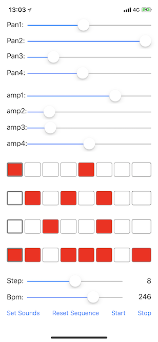

# HKLStepSequencer
<a href="https://developer.apple.com/"></a>
<a href="https://developer.apple.com/swift"></a>
<a href="https://cocoapods.org/pods/HKLStepSequencer"></a>
<a href="https://github.com/Carthage/Carthage"></a>
<a href="https://raw.githubusercontent.com/hirohitokato/HKLStepSequencer/master/LICENSE"></a>

A step sequencer engine for iOS. It enables you to create a rhythmbox/drum-machine app easily.

# Features

- M tracks & N steps sequencer.(depends on your iOS device spec)
- gain & pan parameters for each track
- supports 44100Hz/16bits linearPCM audio data
- supports over 1000bpm(actually, there is no limit)

# How to use

- Instantiate a HKLStepSequencer object and use it. 

```swift
import HKLStepSequencer

// 1. Create 16steps x 4tracks synthesizer
let engine = HKLStepSequencer(numOfTracks: 4, numOfSteps: 16)
engine.tempo = 120

// 2. Load sounds
engine.sounds = ["kick.wav", "snare.wav", "zap.wav", "noiz.wav"]

// 3. Set step sequences
var track0 = [Bool](repeating: false, count: engine.numberOfSteps)
var track1 = [Bool](repeating: false, count: engine.numberOfSteps)
var track2 = [Bool](repeating: false, count: engine.numberOfSteps)
var track3 = [Bool](repeating: false, count: engine.numberOfSteps)

for i in 0 ..< engine.numberOfSteps {
    track0[i] = ((i % 4) == 0) // kick
    track1[i] = ((i % 3) == 0) // snare
    track2[i] = ((i % 2) == 0) // zap
    track3[i] = ((i % 1) == 0) // noiz
}
engine.setStepSequence(track0, ofTrack: 0)
engine.setStepSequence(track1, ofTrack: 1)
engine.setStepSequence(track2, ofTrack: 2)
engine.setStepSequence(track3, ofTrack: 3)

// 4. Start playing
engine.start()
```

- Can change each track's pan position & gain

```swift
// track0: left, track1: right, other: center(0.0)
engine.setPanPosition(-1.0/*left*/,  ofTrack: 0)
engine.setPanPosition( 1.0/*right*/, ofTrack: 1)

// track2 gain: x2.0(0.0-2.0)
engine.setAmpGain(2.0, ofTrack: 2)
```

- Can trigger event of each step. The callback passes the precise time of step. So you can synchronize animations with sounds.

```swift
var info = mach_timebase_info(numer: 0, denom: 0)
mach_timebase_info(&info)
let numer = UInt64(info.numer)
let denom = UInt64(info.denom)

engine.onTriggerdCallback = {
    (tracks: [Int], stepNo: Int, absoluteTime: UInt64) in
    let t_ns = ((absoluteTime - mach_absolute_time()) * numer) / denom
    let t_sec = Double(t_ns) / 1_000_000_000
    print("<\(stepNo)> \(tracks) will fire after \(t_sec)sec")
}
```

# Methods

- `start()` starts sequencer
- `stop()` stops running
- `tempo` property sets its bpm
- `numTracks` property decides the number of tracks.
- `numSteps` property decides total steps of the sequencer
- `sounds` property sets a sound file names for each track.
- `setStepSequence()` sets a note on/off sequence for the specified track.
- `setAmpGain()` sets an amp gain for the specified track.
- `setPanPosition()` sets a panning position for the specified track.

The class interface is as follows:

```swift
public class HKLStepSequencer : NSObject {

/// callbacks from the audio engine to tell that the sequencer has triggered at the step(time).
///
/// - Parameters:
///   - tracks: an array of tracks that the note is now ON
///   - stepNo: the index of current step
///   - absoluteTime: host time when the note is triggered
public typealias TriggerdCallback = (_ tracks: [Int], _ stepNo: Int, _ absoluteTime: UInt64) -> ()

/// callbacks from the audio engine to tell that the sequencer has triggered at the step(time).
///
/// - Parameters:
///   - tracks: an array of tracks that the note is now ON
///   - stepNo: the index of current step
///   - absoluteTime: host time when the note is triggered
public var onTriggerdCallback: TriggerdCallback?

/// Instantiate a object and initialize it.
///
/// - Parameters:
///   - numOfTracks: The number of tracks the sequencer has
///   - numOfSteps: The number of steps in a track
///   - stepsPerBeat: The number of steps in one beat
public init(numOfTracks: Int, numOfSteps: Int, stepsPerBeat: Int = default)

/// bpm
public var tempo: Double { get set }

/// number of tracks the sequencer has
public var numberOfTracks: Int { get set }

/// number of steps in a track
public var numberOfSteps: Int { get set }

///  Sound files for each track. The number of sounds must be equal to the number of tracks
public var sounds: [String]? { get set }

/// Set sequence for the specified track.
///
/// The sequence contains NSNumber<bool> values. The size must be equal to numSteps property.
///
/// - Parameters:
///   - sequence: an array of bool values. true means note on.
///   - trackNo: target track number
public func setStepSequence(_ sequence: [Bool], ofTrack trackNo: Int)

/// Erase all notes(ON/OFF) of the specified track
///
/// - Parameter trackNo: target track number
public func clearSequence(ofTrackNo trackNo: Int)

/// Set amplifier gain(0.0-2.0) for the specified track
///
/// - Parameters:
///   - ampGain: 0.0(mute)…1.0(as is)…2.0(x2.0)
///   - trackNo: target track number
public func setAmpGain(_ ampGain: Double, ofTrack trackNo: Int)

/// Set pan position(-1.0…1.0) for the specified track.
///
/// - Parameters:
///   - position: -1.0(left)…0.0(center)…1.0(right)
///   - trackNo: target track number
public func setPanPosition(_ position: Double, ofTrack trackNo: Int)

/// Start the sequencer
public func start()

/// Stop the sequencer
public func stop()
}
```
# Screenshots of sample project

The sample shows 4 tracks & N steps sequencer.



# License

New BSD License

# Reference

This library uses [the sample program](https://code.google.com/p/korg-wist-sdk/) of [KORG WIST SDK](http://www.korguser.net/wist/) as audio engine.
